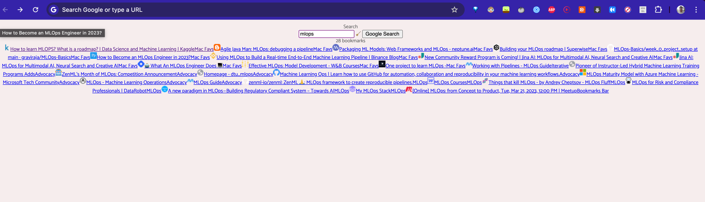

# zero-bookmark 📚

zero-bookmark is a Chrome extension that allows users to quickly access and manage their bookmarks from the new tab page. It provides a streamlined interface for searching, viewing, and organizing bookmarks, with customizable themes and layouts.



</p>

## Prerequisites

Before using the Zero Bookmarks extension, ensure that you have Google Chrome installed.

## Installation

1. Clone the repository:

```bash
git clone https://github.com/yourusername/zero-bookmarks.git
cd zero-bookmarks
```

2. Load the extension in Chrome:
Open Chrome and navigate to chrome://extensions/. Enable "Developer mode" in the top right corner.
3. Click on "Load unpacked" and select the zero-bookmarks directory.
Usage

> Once the extension is loaded, it will override the default new tab page. You can start using Zero Bookmarks to search and manage your bookmarks.

## Features
Bookmark Search: Quickly search through your bookmarks using the search bar.
Google Search Integration: Perform Google searches directly from the new tab page.
Bookmark Grid Layout: View your bookmarks in a customizable grid layout.


## Project Structure
- `index.html`: The main HTML file for the new tab page.
- `index.css`: The main CSS file for styling the new tab page.
- `src`: Contains JavaScript files for the extension's functionality.
- `manifest.json`: The manifest file that defines the extension's properties and permissions.

## Scripts
- `background.js`: Handles background tasks and event listeners.
- `newtab.js`: Contains the main logic for the new tab page.


# License

This project is licensed under the MIT License.

# Acknowledgements

Normalize.css - CSS reset

Google Fonts - Catamaran - Font family

Font Awesome - Icon library

Macy.js - Grid layout library

Feel free to contribute to this project by submitting issues or pull requests on GitHub. For any questions, please contact mert@mertbozkir.com.